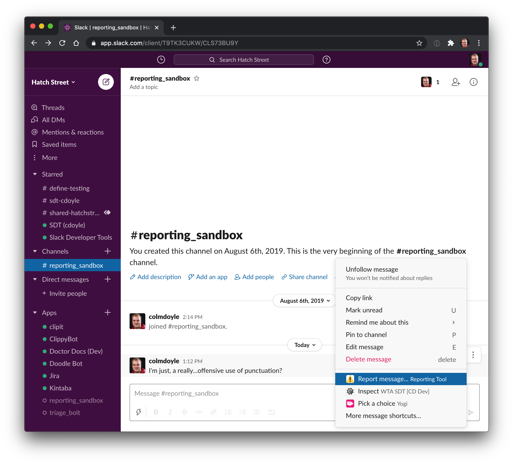
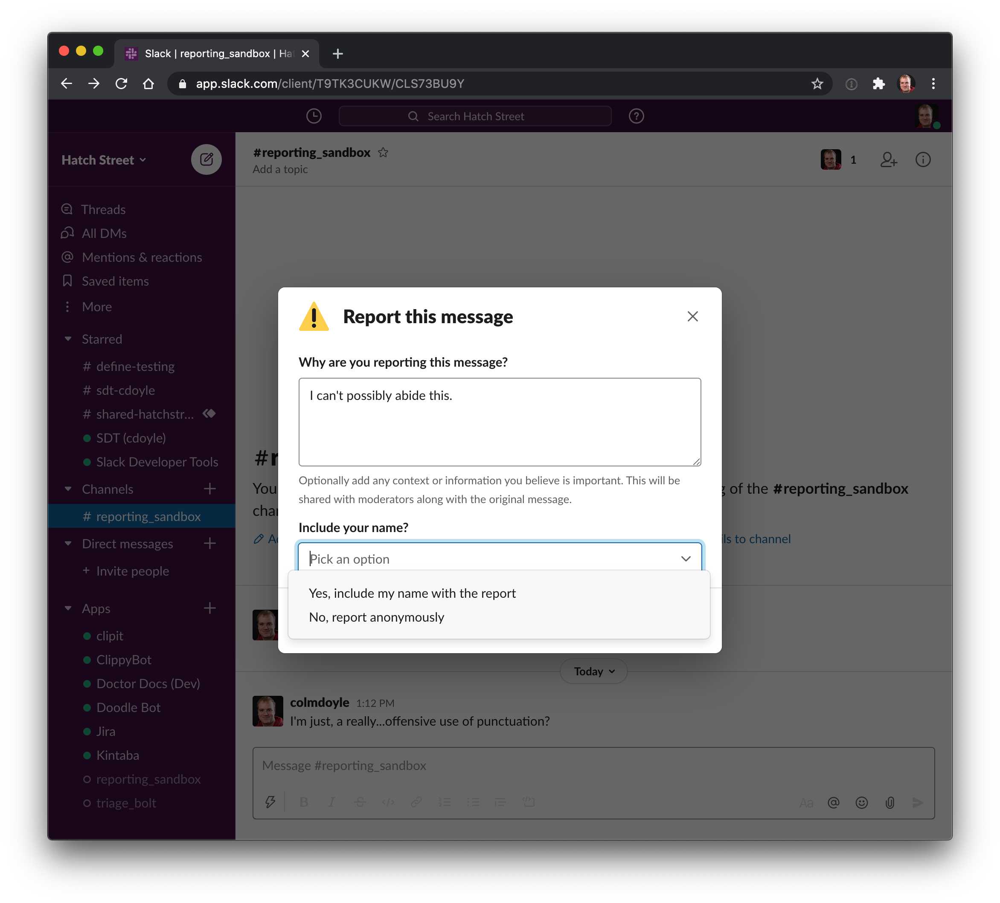
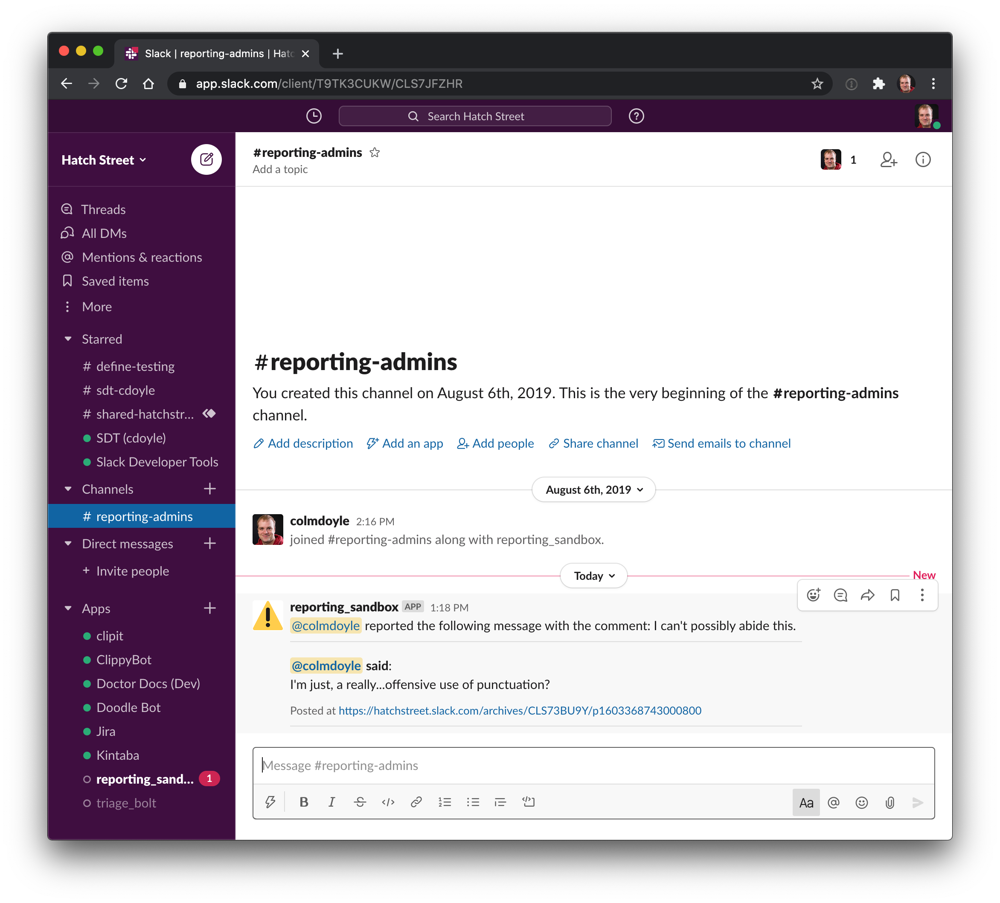

# Slack Reporting Tool

## About the app

A Slack app to let anyone in a workspace report a message to a private channel because the message is offensive, harassing, or violates the Code of Conduct.

Details of how to install it can be found [here](./docs/installation.md)

## Screenshots

### User reporting flow

**User chooses "Report message..." shortcut from the context menu**

**User fills in details of report**

### Admin experience

**Reports are posted to a predefined channel**

